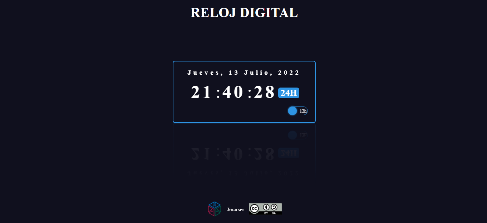
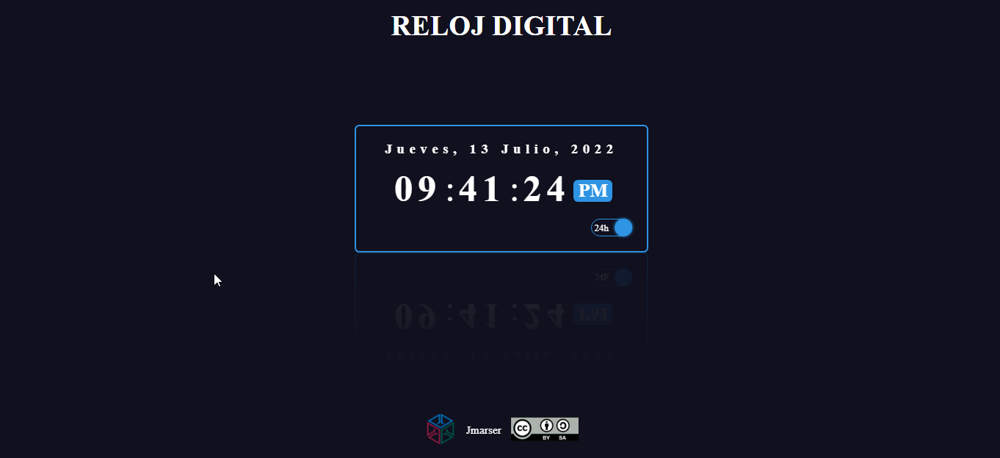

RELOJ DIGITAL
===

Aplicación web que simula un reloj digital con la función de poderlo poner tanto en formato 24H o 12H.

### 1. Tecnologías ###
La aplicación esta desarrollada con tecnología front-end
- HTML
- CSS
- JavaScript

### 2. Funciones ###
La aplicación desarrolla de manera automática:
- Muestra la hora del sistema.
- Muestra la fecha actual del sistema.
- Muestra la hora en formato 24H.

La aplicación permite el cambio del formato de la hora entre 24H y 12H.

### 3. Algunas capturas ###

### 4. Licencia ###
Puedes compartir esta aplicación atribuyendo al autor y sin realizarle modificaciones

